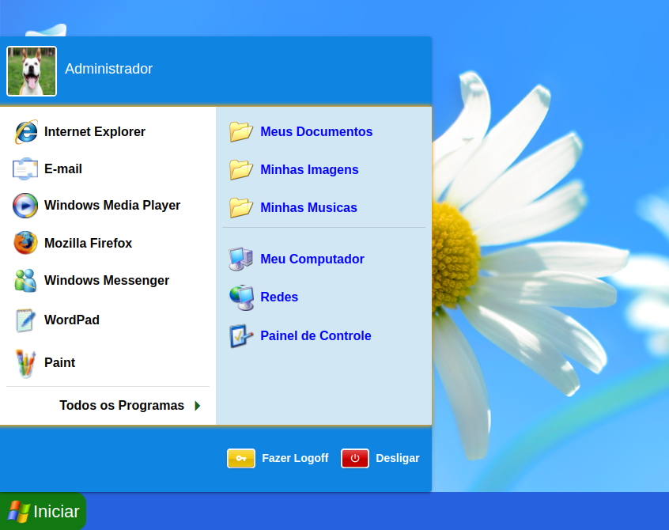

<h1>Windows - XP</h1>
<h3>Projeto feito utlizando Vue3.js e Quasar Framework</h3>

<h2>Ideia do projeto: </h2>

```
Criar uma cópia não exata do classico do Windows XP, com intuito de praticar minhas skills com Front-End, utlizando ferramentas modernas.
```

##### O que já funciona ?


<li>Drag no Desktop</li>
<li>Renomear, Excluir e adicionar novos icones no Desktop</li>
<li>Renomear, Excluir e adicionar novos icones no Desktop</li>
<li>Alterar o Wallpaper e a cor de tema</li>
<li>Fechar Window, Maximinizar e Minimizar janelas</li>
<li>Menu do desktop ao clicar com o botão direito</li>
<li>Menu do programa ao clicar com o botão direito no icone</li>
<li>Relogio utlizando horario real</li>
<li>Sons de inicio e de encerramento</li>
<li>As janelas podem ser arrastadas e movidas</li>
<li>Tamanho dos icones do desktop podem ser alterados</li>

##### O que é utlizado para funcionar ?
<li>LocalStorage armazena o nome do wallpaper e a cor do tema do sistema</li>
<li>SessionStorage armazena um booleano que identifica se o sistema ja foi iniciado para exibir ou não tela de loading inicial</li>


####Alguns Print's :




```
Esse projeto não tem como objetivo roubar ou usar de forma inapropriada as imagens do Windows e da Microsoft, o projeto é 100% educativo !
```

Feito por mim Vinicius Fortes

